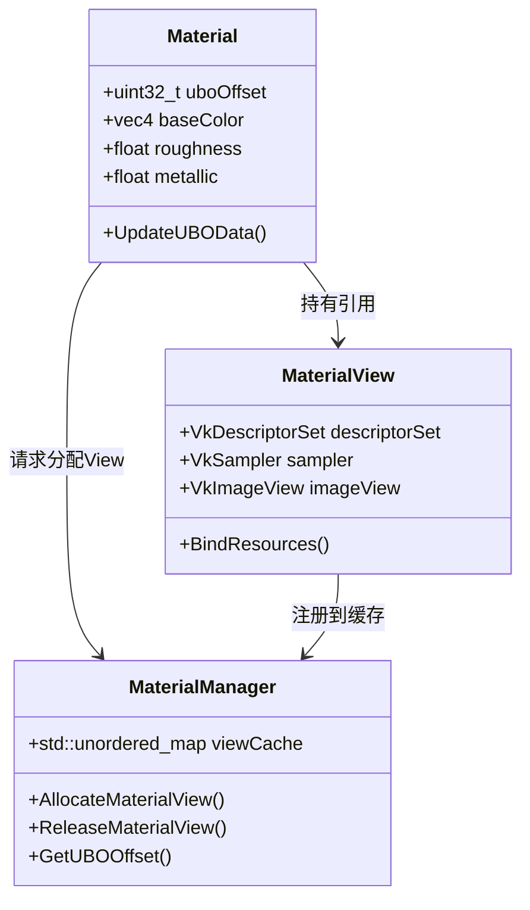

# 资源管理思路
- 目前的想法为为一个模型挂载模块，挂载Mesh、material。因此就对Model实现一个modelmamager用于管理每个模型实列ModelInstance，每一个实例可以挂载:
    - mesh、material。

- mesh是如何存储对应得buffer的？
    - 首先，使用buffermanager创建一个indexbuffer以及一个vertexbuffer，并且会生成一个对应的id，mesh里面就存了这两个buffer的id。在遍历的时候，就可以把这两个id对应的buffer从buffermanager里面拿出来。
    - 此外，有一个BufferInfo的结构体，用来存储vkbuffer的信息，包括VkBuffer以及VkdeviceMemory。

- 因此，mesh就用于加载模型，material还待定。并且每个mesh在资源浏览器加载完毕之后，还不用着急读取数据，可以做一个懒加载，等到我要使用这个mesh再加载。同时也方便我做一个相关的列表的gui。

- 同一个textureImg的材质可以共同使用一个descriptor。初级的来说，每对应一个材质的image就要创建一个descriptor，并且和原先的descriptor区分开，因此，在shader内就要使用set来区分。但是这样的话就会由于材质多了导致set出现不易匹配的情况？目前的思路是：使用materialmanager来管理material的类。每个material类里面包含一个descriptor以及对应的一些参数。同时material还要绑定对应的uniformbuffer，我能不能使用一个大的uniformbuffer并且预留一些可能添加数值的槽位。
    - 因此，对应的就是这样的：使用material来记录对应材质的参数以及在ubo中对应的offset，使用materialviewe来记录sampler以及descriptorset，使用materialmanager来记录materialviewe并且给material分配对应的materialviewer，并且保证同一个textureimage使用同一个sampler以及descriptorset。

- 首先我思考了以下材质应该如何管理，目前还没有考虑ECS等系统，打算重构或者第二个引擎的时候就系统性学习，现在先使用ClassBased系统。

总的来说，materialview用来管理一个材质的贴图以及贴图对应的sampler，viewer以及descriptorset。并且使用一个unordered_map来管理材质、mesh、model的关系。->[model:[mesh]]
[mesh:[model]],这三个的数量依次递增。并且，使用一个dynameicUBO来记录所有材质的属性，方便以后更新，以及对UBO预留了一些内存的插槽用于拓展，可能后面有新属性的材质类的时候就可以拓展了。